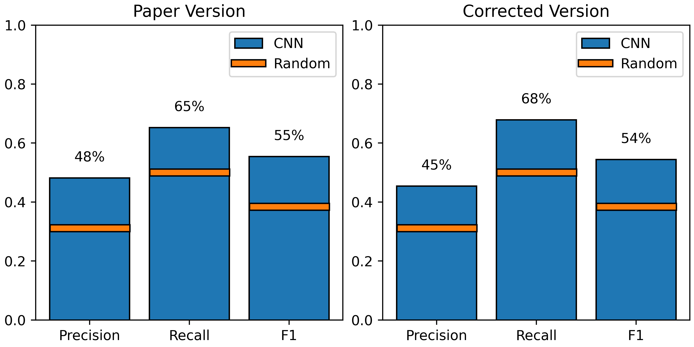
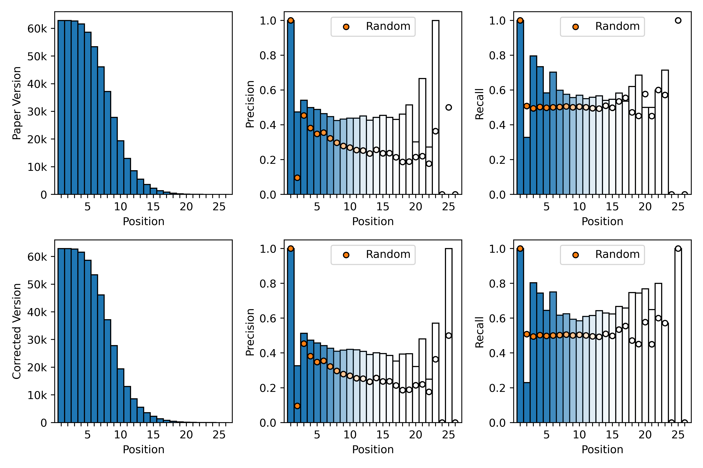
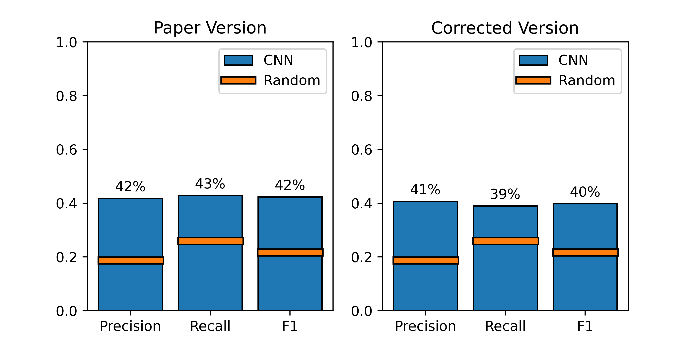
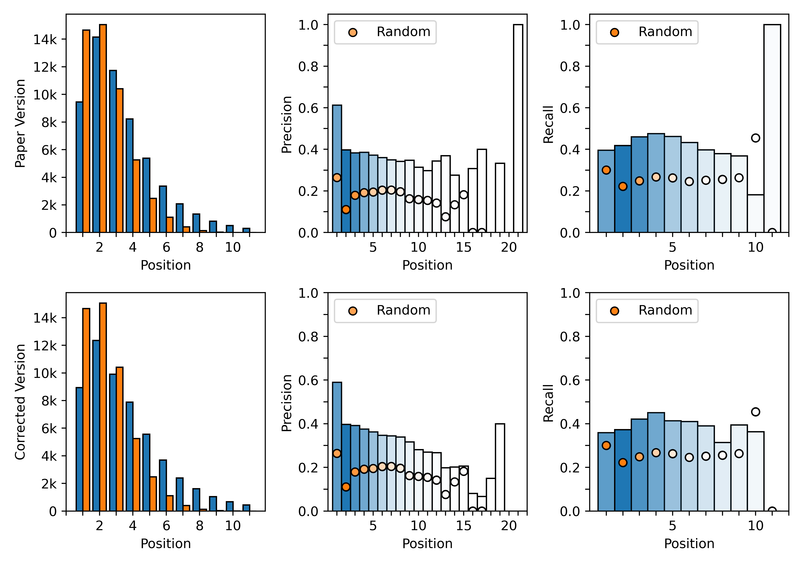
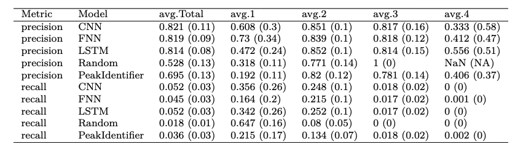
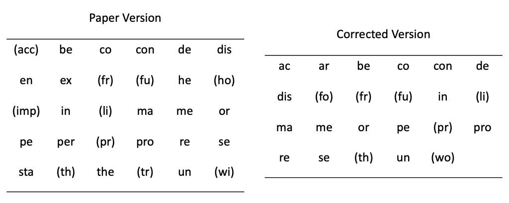

# Computational-Detection-of-Syllable-Boundaries
Code for the paper ["Computational Detection of Syllable Boundaries in Undeciphered Languages Using Segment Surprisal"](https://www.tandfonline.com/doi/full/10.1080/09296174.2025.2575566?src=)

Please see the **Corrections** to the published results [shown below](#corrections).

The complementary data files are hosted at: 10.5281/zenodo.17418251

The online appendix is included above.

## Corrections
Due to an error in the code, some of the results in section 6 of our paper slightly deviate from their true values. Specifically, **Figures 3-6** showing the segment-level and syllable-level metrics for the convolutional neural network (CNN) and **Tables 4-5** require correction. We have reproduced the figures and tables below, showing both the original published and corrected versions. The error is generally below 5%, and it does not change the analysis in the published paper.

In addition, we provide two Jupyter notebooks to reproduce our neural network experiments. [Paper Experiments from Saved Models](https://github.com/frithureiks/Computational-Detection-of-Syllable-Boundaries/blob/main/NeuralNet_model/Paper_Experiments_from_Saved_Models.ipynb) loads the saved models from the paper and reproduces the (corrected) results exactly. [Paper Experiments from Scratch](https://github.com/frithureiks/Computational-Detection-of-Syllable-Boundaries/blob/main/NeuralNet_model/Paper_Experiments_from_Scratch.ipynb) trains new models on the same data and produces similar results, subject to some randomness in the training process.

We apologize for the error.

**Figure 3:** Segment-level precision, recall, and F1 averaged across all languages and all positions.

**Figure 4:** Number of segments and segment-level precision and recall by position.

**Figure 5:** Syllable-level precision, recall, and F1 averaged across all languages and all positions.

**Figure 6:** Number of unique syllables and syllable-level precision and recall by position.

**Table 4:** Metric comparison between different models.

**Table 5:** Beginning syllables predicted more than four times by the CNN model on the English UDHR.

**Stan model**
1. Run Stanmodel_dataprep.R to generate the Stan data from the data file
2. Run the model with Model_run.R which reads in syll_newmodel_alterparam.stan
3. Process and display the results with Bayesian_postprocessing.R

**Neural Net model**

There are two options to reproduce the experiments with the convolutional neural net (CNN) models.

1. Run [Paper Experiments from Saved Models](https://github.com/frithureiks/Computational-Detection-of-Syllable-Boundaries/blob/main/NeuralNet_model/Paper_Experiments_from_Saved_Models.ipynb) to either load the saved models and rerun them on the test data, or directly load the saved results from the test data. This should reproduce the [(corrected)](##corrections) results from the paper exactly.

2. Run [Paper Experiments from Scratch](https://github.com/frithureiks/Computational-Detection-of-Syllable-Boundaries/blob/main/NeuralNet_model/Paper_Experiments_from_Scratch.ipynb) to train new models on the same data and using the same procedures as described in the paper. This should produce similar results to the paper, subject to some randomness in the training process.